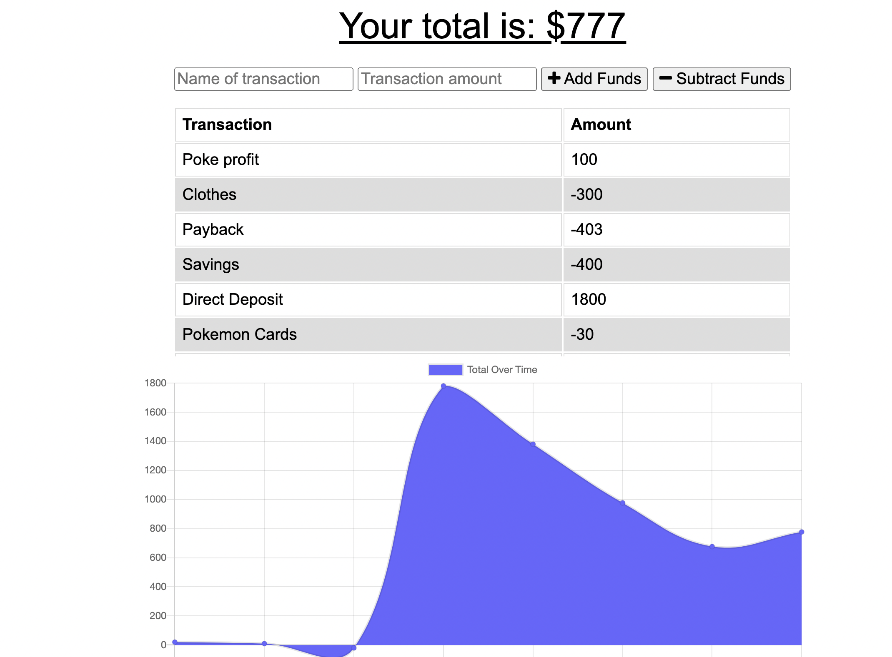

# Progressive-Budget
  

  ## Table of Contents
  * [Task](#task)
  * [Preview](#preview)
  * [Technologies Used](#technologies)
  * [Links](#links)

## Task :man_technologist:
For this assignment, we were tasked with enabling the prebuilt budget tracker application to have offline capabilities and functionalities.

## Preview
[Deployed Application](htpps://howmuchleft.herokuapp.com)

Budget Tracker  

Offline

## Technologies Used
Languages: Javascript
Technologies: Service Worker
Packages: express, mongoose, path

## Links
Repo: https://github.com/uzobeki/Progressive-Budget 
Deployed App: https://howmuchleft.herokuapp.com

## Author
Uzochukwu Obeki